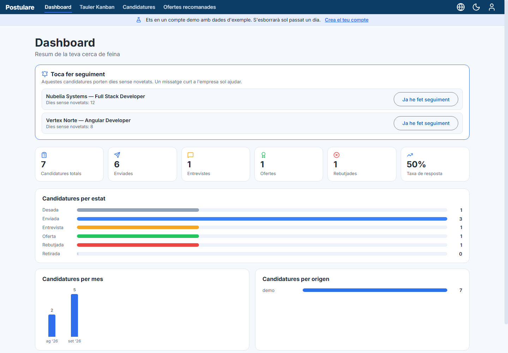
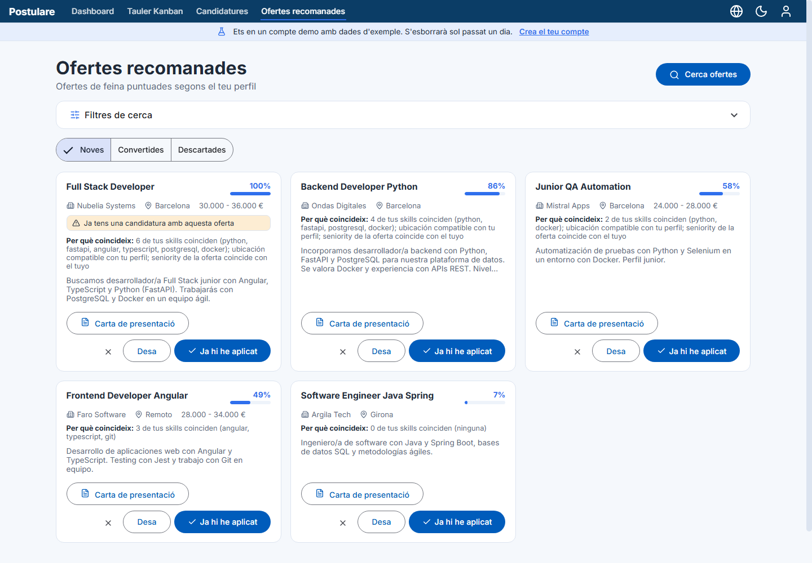
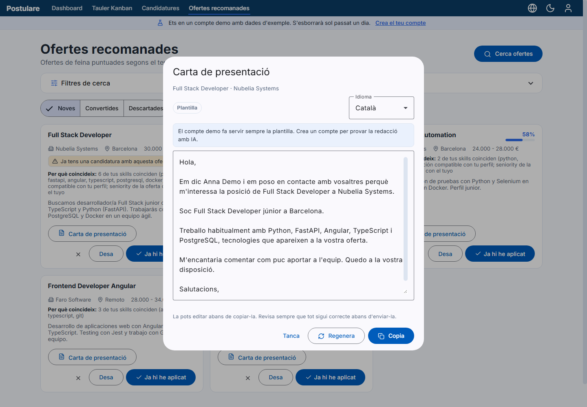
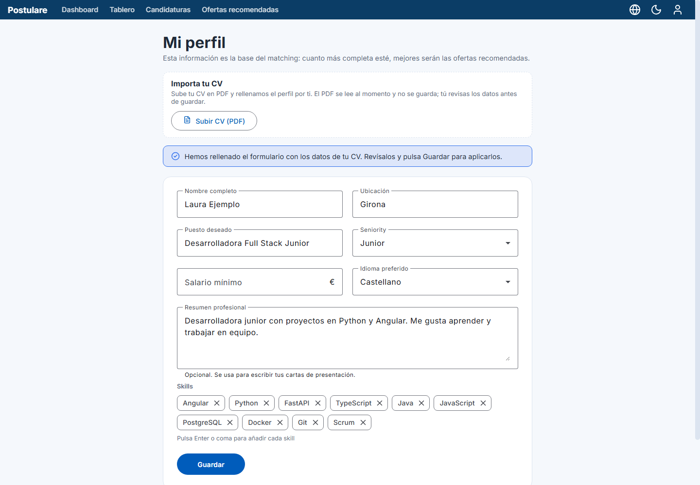
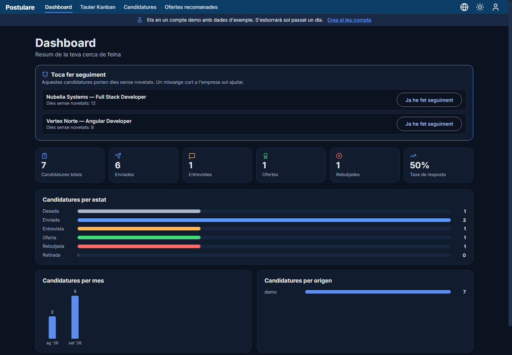

# Postulare — Frontend

[🇪🇸 Español](README.md) · 🇬🇧 English

Web app for **Postulare**, which helps you organise your job hunt: it keeps track of your applications, finds job offers that fit your profile, scores how well they match you, and helps you write the cover letter.

- 🌐 Live demo: <https://postulare.vercel.app> (click **"Try the demo"**, no sign-up needed)
- ⚙️ Backend (FastAPI): [postulare-backend](https://github.com/costanna/postulare-backend)

> The backend runs on Render's free plan, which puts the service to sleep after a while without traffic: the first load may take ~30 s.

**Stack:** Angular 18 (standalone components and signals) · Angular Material · ngx-translate · Lucide · Karma/Jasmine

## What you can do

- **Track your applications** on a Kanban board (drag between statuses) or in a table with filters and pagination. Every status change is kept in a timeline, together with interviews, follow-ups and notes.
- **Find job offers** that fit your profile, with editable filters (keywords, location, radius, exclusions, age, minimum score). Each offer shows its match score and why it fits, and can be **saved**, **marked as already applied** or **dismissed**. It warns you if you already have it among your applications.
- **Write the cover letter** for each offer: with AI (if the server has it enabled) or from a free template, in Catalan, Spanish or English. It is editable and copied with one click.
- **Import your CV as a PDF** to fill in your profile; you review the data before saving.
- **Keep the thread**: the dashboard reminds you of applications with no news for days and shows charts by status, month and source. You can **export everything to CSV**.
- **Try it without signing up** with the demo account.
- **Light/dark** theme, interface in **Catalan, Spanish and English**, and **responsive** design from ~360 px.

## Screenshots

<p>
  
  
  
  
</p>

<p>
  
</p>

## Running locally

Requirements: Node.js 20+ and the [backend](https://github.com/costanna/postulare-backend) running at `http://localhost:8000` (see its README).

```bash
npm install
npm start          # http://localhost:4200, with hot reload
```

The API URL lives in `src/environments/environment.ts` (development) and `environment.prod.ts` (production). It is compiled into the bundle: if the backend URL changes, update it there and redeploy.

| Command | What it does |
|---|---|
| `npm start` | Development server |
| `npm test` | Unit tests (Karma + Jasmine, 92 tests) |
| `npm run build` | Production build in `dist/postulare-frontend/browser` |

### Docker

The [`Dockerfile`](Dockerfile) builds the SPA and serves it with nginx ([`nginx.conf`](nginx.conf), with a fallback to `index.html` for the router). It is meant to run next to the backend using the `docker-compose.yml` in the project's root folder. To build only this image:

```bash
docker build -t postulare-frontend .
docker run -p 4200:80 postulare-frontend
```

## Deployment

Deployed on **Vercel** with Angular's production build (`npm run build`, output directory `dist/postulare-frontend/browser`), which uses `environment.prod.ts`. The backend lives on Render and the database on Neon: see the [backend README](https://github.com/costanna/postulare-backend/blob/main/README.en.md).

## Theme and languages

- **Theme**: CSS variables in `src/styles.scss`, toggled by `ThemeService` through the `[data-theme]` attribute on `<body>`. It follows `prefers-color-scheme` the first time and remembers your choice.
- **Languages**: `src/assets/i18n/{ca,es,en}.json`. The browser language is detected the first time and remembered afterwards; the language saved in your profile is applied when you sign in from any device. Spanish is the fallback when a key is missing.

## Project structure

```text
src/app/
├── core/           services (auth, theme, language, API), guards, HTTP interceptor, models and utilities
├── layout/         shell with top bar, responsive menu and demo-account notice
├── features/
│   ├── auth/           login, sign-up, password reset and the "Try the demo" button
│   ├── dashboard/      summary, pending follow-ups and charts
│   ├── kanban/         applications board with drag & drop
│   ├── applications/   table with filters, form and detail with timeline
│   ├── matches/        recommended offers, filters and cover letter
│   └── profile/        editable profile and CV import
├── shared/         reusable pipes and components
└── app.routes.ts
src/assets/i18n/   translations
docs/screenshots/  screenshots used in this README
```

## License

[MIT](LICENSE) © 2026 Anna Costa
